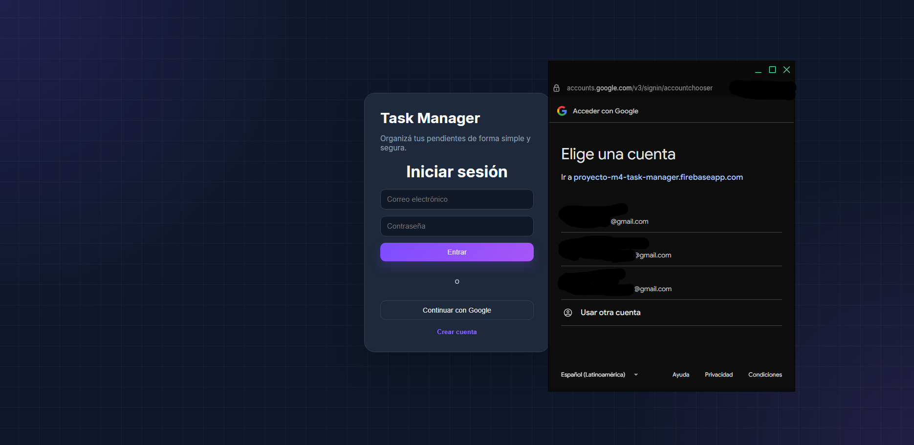
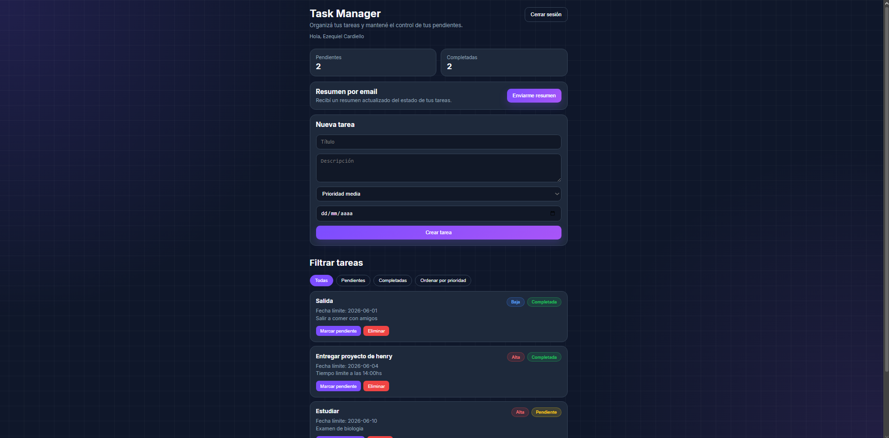
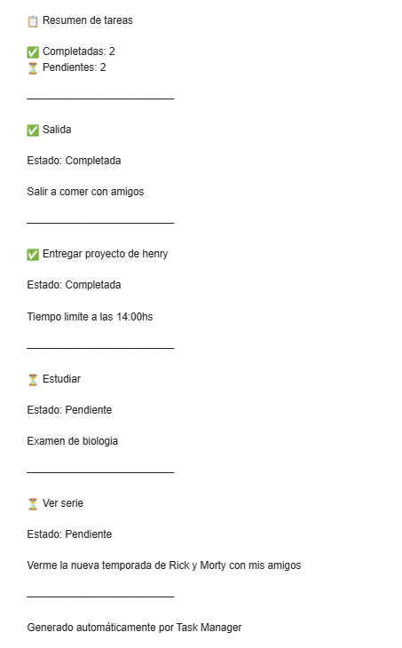

# 🚀 Task Manager

Aplicación web desarrollada con React + TypeScript para gestionar tareas personales de forma simple y organizada.

Permite registrar usuarios, iniciar sesión mediante correo electrónico o Google, administrar tareas con prioridades y fechas límite, y recibir un resumen actualizado por email.

---

## 🌐 Demo

**Aplicación desplegada en Vercel**

https://task-manager-pi-m4.vercel.app

---

## ✨ Funcionalidades

### Autenticación

- Registro de usuarios con email y contraseña.
- Inicio de sesión con email y contraseña.
- Inicio de sesión mediante Google.
- Cierre de sesión seguro.

### Gestión de tareas

- Crear tareas.
- Visualizar tareas.
- Marcar tareas como completadas.
- Marcar tareas como pendientes.
- Eliminar tareas.

### Organización

- Prioridad Alta, Media y Baja.
- Fecha límite para cada tarea.
- Filtros de tareas:
  - Todas
  - Pendientes
  - Completadas
- Ordenamiento por prioridad.

### Resumen por email

- Envío de resumen actualizado mediante AWS SES.
- Conteo de tareas completadas y pendientes.
- Listado detallado del estado de cada tarea.

---

## 🛠 Tecnologías utilizadas

### Frontend

- React
- TypeScript
- Vite

### Backend / Servicios

- Firebase Authentication
- Cloud Firestore
- AWS SES
- Vercel Serverless Functions

### Testing

- Vitest
- Testing Library

### Deploy

- Vercel

---

## 📂 Estructura del proyecto

```text
task-manager-pi-m4
│
├── api
│   └── send-task-summary.ts
│
├── public
│
├── screenshots
│   ├── login.png
│   ├── dashboard.png
│   └── email.png
│
├── src
├── api
├── package.json
└── README.md
│
├── src
│   ├── components
│   │   ├── TaskForm.tsx
│   │   └── TaskList.tsx
│   │
│   ├── features
│   │   ├── auth
│   │   │   └── auth.service.ts
│   │   │
│   │   └── tasks
│   │       └── task.service.ts
│   │
│   ├── hooks
│   │   ├── useAuth.ts
│   │   └── useTasks.ts
│   │
│   ├── pages
│   │   ├── DashboardPage.tsx
│   │   ├── LoginPage.tsx
│   │   └── RegisterPage.tsx
│   │
│   ├── routes
│   │   └── ProtectedRoute.tsx
│   │
│   ├── services
│   │   ├── email.service.ts
│   │   └── firebase.ts
│   │
│   ├── tests
│   │   ├── firebaseErrors.test.ts
│   │   ├── TaskForm.test.tsx
│   │   └── TaskList.test.tsx
│   │
│   ├── types
│   │   └── Task.ts
│   │
│   └── utils
│       └── firebaseErrors.ts
│
├── package.json
└── README.md
```

---

## ⚙️ Instalación local

### Clonar repositorio

```bash
git clone https://github.com/AlanEzequiel112/proyecto-m4-task-manager.git
```

### Ingresar al proyecto

```bash
cd proyecto-m4-task-manager
```

### Instalar dependencias

```bash
npm install
```

### Crear variables de entorno

Crear un archivo `.env` utilizando `.env.example` como referencia.

### Ejecutar proyecto

```bash
npm run dev
```

---

## 🧪 Tests

Ejecutar todos los tests:

```bash
npm run test:run
```

---

## 📸 Capturas

### Login



### Dashboard



### Resumen por email



---

## 🤖 Uso de Inteligencia Artificial

Durante el desarrollo se utilizaron herramientas de Inteligencia Artificial como apoyo para:

- Resolver errores de configuración.
- Organizar la estructura del proyecto.
- Diseñar componentes y estilos.
- Implementar funcionalidades con Firebase.
- Integrar AWS SES.
- Crear y corregir tests.
- Mejorar la experiencia de usuario.

### Ejemplos de prompts utilizados

- "¿Cómo integrar Firebase Authentication con React y TypeScript?"
- "¿Cómo enviar emails utilizando AWS SES desde una función serverless en Vercel?"
- "¿Cómo organizar un proyecto React utilizando hooks y services?"
- "¿Cómo crear tests para componentes React utilizando Vitest y Testing Library?"

### Influencia en la implementación

Las respuestas obtenidas sirvieron como guía para:

- Comprender tecnologías nuevas.
- Resolver problemas específicos.
- Evaluar diferentes alternativas de implementación.

### Decisiones tomadas

A partir de la información obtenida se decidió:

- Utilizar Firebase Authentication para la gestión de usuarios.
- Utilizar Firestore como base de datos.
- Utilizar AWS SES para el envío de emails.
- Implementar autenticación con Google.
- Incorporar prioridades y fechas límite para mejorar la organización de tareas.
- Mantener una arquitectura modular basada en componentes, hooks y servicios.

---

## 👨‍💻 Autor

**Ezequiel Cardiello**

Proyecto Integrador M4 - Henry -